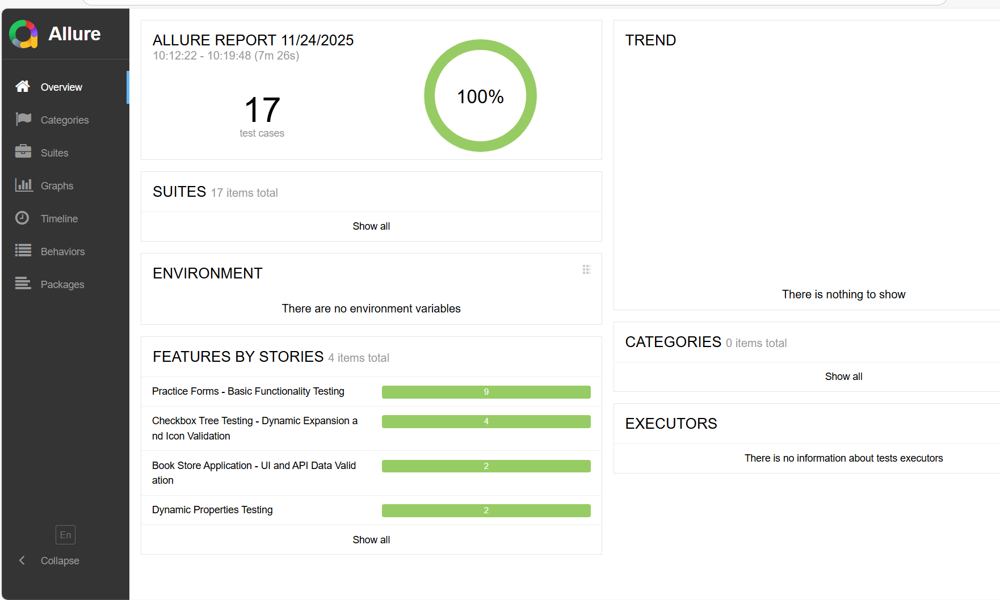

# DemoQA Test Automation Framework (Python + Selenium + Behave)

This is a comprehensive test automation framework, built for web application testing, leveraging BDD principles to bridge the gap between technical and non-technical team members. The framework uses Python with Selenium WebDriver and Behave to create a maintainable and scalable testing solution that grows with our project needs.

## Key Features

- 🎯 **Behavior-Driven Development (BDD)** - Gherkin syntax with Behave enables stakeholders to write and understand tests in plain English
- 🏗️ **Page Object Model (POM)** - Centralized element management with separated test logic for maintainable and scalable automation
- 📊 **Comprehensive Reporting** - Allure integration with interactive HTML reports, screenshots on failure, and historical trend analysis
- ✨ **Code Quality Management** - Automated code formatting (Black), import sorting (isort), and linting (Flake8, Pylint) via centralized pyproject.toml configuration
- 🚀 **Custom Test Runner** - CLI-based test orchestrator (`run_tests.py`) with tag filtering (@smoke, @critical, @regression), execution tracking, and automated report generation with artifact summaries
---

## Tech Stack

| Category | Technology | Version | Purpose |
|----------|-----------|---------|---------|
| **Language** | Python | 3.8+ | Core programming language |
| **Web Automation** | Selenium WebDriver | 4.15.2 | Browser automation |
| **BDD Framework** | Behave | 1.2.6 | BDD implementation for Python |
| **Test Reporting** | Allure | 2.13.2 | Interactive HTML reports |
| **API Testing** | Requests | 2.31.0 | HTTP library for REST API validation |
| **WebDriver Management** | WebDriver Manager | 4.0.1 | Automatic browser driver management |
| **Configuration** | python-dotenv | 1.0.0 | Environment-based configuration |

---

## Framework Structure

```
demoqa_automation/
│
├── config/                          # Configuration Layer
│   ├── __init__.py
│   ├── config.py                    # Central configuration
│   └── browser_manager.py           # WebDriver management
│
├── features/                        # BDD Test Scenarios (Gherkin)
│   ├── *.feature                    # Feature files
│   ├── environment.py               # Behave hooks
│   └── steps/                       # Step Definitions
│       ├── common_steps.py          # Reusable steps
│       └── *_steps.py               # Feature-specific steps
│
├── pages/                           # Page Object Model Layer
│   ├── base_page.py                 # Base class with common methods
│   ├── locators.py                  # Centralized locator repository
│   └── *_page.py                    # Page-specific classes
│
├── utils/                           # Utility Modules
│   ├── api_client.py                # REST API client
│   ├── screenshot_handler.py        # Screenshot capture
│   └── retry_decorator.py           # Retry decorator
│
├── logs/                            # Execution Logs
├── reports/                         # Test Reports & Artifacts
│   ├── allure_reports/              # Allure JSON results
│   ├── allure_html/                 # Generated HTML reports
│   └── screenshots/                 # Failure screenshots
│
├── behave.ini                       # Behave configuration
├── requirements.txt                 # Python dependencies
├── run_tests.py                     # Test runner
└── pyproject.toml                   # Project configuration
```

---

## Requirements Traceability Matrix

This matrix maps each requirement to its corresponding test case implementation, demonstrating comprehensive test coverage across all acceptance criteria.

| Requirement ID | Description | Test Case ID | 🟢 Additional detailing covered in test cases |
|---------------|-------------|--------------|----------------------------------------------|
| **1.a** | Navigate to Elements > Checkbox. Dynamically expand the tree at all levels. | TC001 | ✅ **Background**: Validates navigation to Elements card, URL verification (`demoqa.com/checkbox`), menu expansion with 9 items validation<br>✅ **Tree Expansion**: Expands entire tree hierarchy using (+) expand all button<br>✅ **Hierarchy Validation**: Validates all 17 nodes visible (Home → Desktop → Documents → WorkSpace/Office → Downloads)<br>✅ **Icon Validation**: Verifies collapse (-) icons appear on all expandable nodes after expansion |
| **1.b** | Tick a parent node (of your choosing) and dynamically assert that all nested elements have correct icons | TC002, TC003, TC004 | ✅ **TC002**: Cascading selection - WorkSpace parent checked → validates all children auto-checked (React, Angular, Veu), ancestor nodes show indeterminate state, siblings remain unchecked<br>✅ **TC003**: Multiple parent selection - WorkSpace + Office both selected → validates all children checked, common parent indeterminate, unrelated nodes unchecked, selection result includes both branches<br>✅ **TC004**: Deselection behavior - validates rollback when unchecking parent, all children unchecked, ancestors return to unchecked state, selection result becomes empty<br>✅ **Bonus**: Works programmatically for any parent node in tree structure |
| **2.a** | Navigate to Elements > Dynamic Properties. Fluently wait for button with text "Visible after 5 seconds" to be displayed | TC005 | ✅ **Background**: Navigation validation to Elements card, menu expansion, URL verification (`demoqa.com/dynamic-properties`)<br>✅ **Fluent Wait Implementation**: Uses WebDriverWait with explicit expected conditions (no hard-coded sleep)<br>✅ **Polling Mechanism**: Continuously polls for element visibility until 5-second timeout<br>✅ **Button Validation**: Confirms button with exact text "Visible After 5 Seconds" appears and is visible after delay |
| **2.b** | Load the page and verify that the second button changes color after some time | TC006 | ✅ **Initial State Capture**: Captures baseline CSS color property of "Color Change" button at page load<br>✅ **Dynamic Wait**: Implements smart wait mechanism for CSS property changes (no fixed sleep)<br>✅ **Color Comparison**: Validates button color transforms to different value than initial state<br>✅ **CSS Property Validation**: Direct validation of computed style color values |
| **3** | Navigate to Forms > Practice Forms. Identify and implement 1-2 test scenarios to test field validation | TC007, TC008, TC009, TC010, TC011 | ✅ **TC007 (Negative)**: Empty form submission → validates 4 mandatory fields (First Name, Last Name, Gender, Mobile) show red border error<br>✅ **TC008 (Positive)**: Valid submission with all required fields → validates successful submission modal displays correct data (Name, Email, Gender, Mobile, DOB with date formatting)<br>✅ **TC009 (Data-Driven)**: Mobile field validation with 3 invalid scenarios → rejects short numbers (98), text input (hello world), special characters (98@#$67890)<br>✅ **TC010 (Boundary)**: Mobile field auto-limit → validates max 10 digits, excess input (15 digits) truncated<br>✅ **TC011 (Data-Driven)**: Email validation with 3 invalid formats → rejects plaintext, incomplete addresses (user@, user@domain)|
| **4** | Navigate to Book Store Application. Look at the list of books and use the api to validate the correctness of the data displayed on the book store page | TC012, TC013 | ✅ **TC012 (API Integration)**: Sends GET request to `/BookStore/v1/Books` endpoint → validates HTTP 200 status → verifies "books" array in response → compares book count UI vs API → validates exact field-level match for each book (title, author, publisher) → verifies all book image URLs valid and displayed<br>✅ **TC013 (Negative Search)**: Search with non-existent title "NonExistentBookTitle12345XYZ" → validates zero results, "No rows found" message displayed<br>

---

**🔍 Additional Quality Measures:**
- ✅ Complete navigation flow validation in every Background section
- ✅ URL verification for correct page routing
- ✅ Menu expansion and item verification before test execution
- ✅ Multiple assertion types: icon states, CSS properties, element visibility, data matching
- ✅ Edge case coverage: empty forms, invalid inputs, non-existent searches, boundary values

---

## What You'll Need

Before getting started, make sure you have these installed:

| Software | Version | Why You Need It |
|----------|---------|-----------------|
| Python | 3.8 or higher | The framework runs on Python |
| pip | 24.0.0 or higher | For installing dependencies |
| Git | Latest stable | To clone the repository |
| Chrome or Firefox | Latest stable | The browser where tests will run |
| Allure CLI | 2.13.0 or higher | Optional, but recommended for viewing reports |

Quick check to verify your setup:

```powershell
python --version
pip --version
git --version
```

---

## Getting Started

### Step 1: Clone the Repository

```powershell
git clone https://github.com/laxmigudami/demoqa-automation.git
cd demoqa_automation
```

### Step 2: Set Up Virtual Environment

I always recommend using a virtual environment to keep dependencies isolated:

```powershell
python -m venv venv
venv\Scripts\activate
```

You'll see `(venv)` in your terminal prompt when it's activated.

### Step 3: Install Dependencies

```powershell
python -m pip install --upgrade pip
pip install -r requirements.txt
```

This installs everything you need: Selenium, Behave, Allure, and other supporting libraries.

### Step 4: Verify Everything Works

```powershell
behave --version
python run_tests.py --help
```

If both commands run without errors, you're good to go!

### Step 5: Configure (Optional)

The framework works out of the box with sensible defaults, but you can customize settings using environment variables.

**Quick Setup:**

```powershell
# Copy the example .env file
cp .env.example .env

# Edit .env file with your preferred settings
notepad .env
```

**Note:** The `.env.example` file contains all available options with detailed comments. Simply copy it to `.env` and customize as needed.

---

## Running Your Tests

### Run Everything

```powershell
python run_tests.py
```

This executes the full test suite and generates Allure reports automatically.

### Run Specific Features

```powershell
# Checkbox tests only
python run_tests.py --features="features/checkbox_tree_dynamic_expansion_and_validation.feature"

# Form validation tests
python run_tests.py --features="features/practice_forms_field_validation.feature"
```

### Run by Tags

I've tagged tests by type and priority so you can run subsets:

```powershell
# Quick smoke tests
python run_tests.py --tags="@smoke"

# All functional tests
python run_tests.py --tags="@functional"

# Critical priority tests only
python run_tests.py --tags="@critical"

# Combine tags
python run_tests.py --tags="@smoke and @functional"
```

### Using Behave Directly

You can also use Behave commands directly if you prefer:

```powershell
# Run all features
behave features/

# Run a specific scenario by name
behave -n "TC001 - Dynamically expand the tree at all levels"

# Dry run to validate scenarios without execution
behave --dry-run features/
```

---

## Test Reports with Allure

### Setting Up Allure (One-Time Setup)

If you haven't installed Allure CLI yet, here are two ways to do it:

**Option 1: Manual Installation**
1. Download the latest release from [Allure Releases](https://github.com/allure-framework/allure2/releases)
2. Extract it to `C:\allure\`
3. Add `C:\allure\allure-2.24.0\bin` to your System PATH
4. Verify with `allure --version`

**Option 2: Using Scoop (easier)**
```powershell
scoop install allure
allure --version
```

### Viewing Your Test Reports

After running tests, view the results:

```powershell
# Quick view - opens report in browser automatically
allure serve reports/allure_reports

# Generate a permanent HTML report
allure generate reports/allure_reports -o reports/allure_html --clean
allure open reports/allure_html
```

### Sample Allure Report



The Allure report provides a comprehensive view with pass/fail statistics, execution timeline, detailed step breakdowns, and automatic screenshot attachments for failures.

### How Tests Are Distributed

I've covered different testing aspects:
- **Functional Testing**: Core feature validation (6 tests)
- **Integration Testing**: UI-API consistency checks (2 tests)
- **Data-Driven Testing**: Multiple inputs per scenario (2 tests)
- **Negative Testing**: Invalid inputs and error handling (2 tests)
- **Boundary Testing**: Input limits and edge cases (1 test)

---

## Tips and Troubleshooting

### Customizing Configuration

You can adjust these settings in your `.env` file or `config/config.py`:

**Browser Settings:**
- Choose your browser: chrome, firefox, or edge
- Run headless (faster, no GUI): set HEADLESS=true

### When Tests Fail

Here's my debugging process:

```powershell
# First, check the logs
type logs\behave_execution.log

# Look at the failure screenshot
explorer reports\screenshots
```

### Running Tests Faster

For local development or CI/CD pipelines:

```powershell
# Run in headless mode (no browser GUI)
# Set HEADLESS=true in config

# Run only critical tests
python run_tests.py --tags="@critical or @smoke"
```


---

## Need Help?

If you run into issues, here's what helps me troubleshoot:

- Which Python version you're using (`python --version`)
- Your browser and its version
- The full error message from the logs
- Any screenshots from failed tests
- What you were trying to do when it failed

Check the `logs/` directory for detailed execution logs, and `reports/screenshots/` for visual evidence of failures.

---
